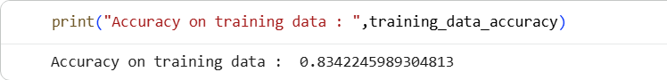
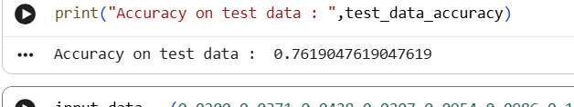
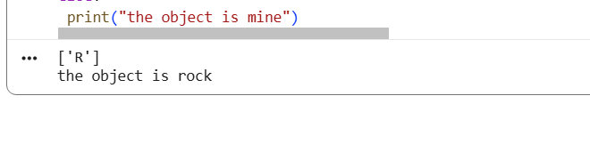

# Sonar Rock vs Mine Classification

## 📌 Project Overview

This project uses Machine Learning (Logistic Regression) to classify sonar signals as:

* Rock (R)
* Mine (M)

## 📂 Dataset

* Sonar dataset (CSV format)
* 60 features + 1 target column

## ⚙️ Technologies Used

* Python
* NumPy
* Pandas
* Scikit-learn

## 🚀 How to Run

1. Open the notebook
2. Run all cells
3. Ensure dataset file is in same directory

## 📊 Model Used

* Logistic Regression

## 🎯 Output

* Predict whether object is Rock or Mine
* ## 📸 Output

